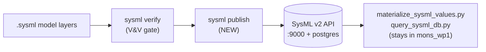

# Publish step harmonization (`sysml publish`)

This note explains the Phase 3 publisher changes made in SysMLInfra, why they were
done this way, how they fit the model pipeline, and which PR #31 review comments
they address.

## Goal

Satisfy `dnv-internal/mons_wp1` PR #31 review comments **6, 7, and 8**:

- **6 / 7** — pythonise `publish_bilgepump.sh`, reusing `check_api_server` (from
  `sys_infra/commit.py`) and `_run_kernel_publish` (from `sys_infra/verify.py`)
  instead of re-implementing them in bash.
- **8** — define a versioning policy: carry a commit hash/version in the project,
  publish a fresh project per model state, and delete the previous outdated
  project rather than accumulating versions.

## Workflow: before vs. after

**Before** (`mons_wp1/publish_bilgepump.sh`):

```
bash script → curl the API to check it's up → invoke kernel publish by hand → no versioning
```

This re-implemented logic that already lived in SysMLInfra.

**After** — a single CLI entry point in the canonical repo:

```
sysml publish  →  check_api_server()              (reused from commit.py)
              →  build_publish_notebook()         (sys_infra/publish_notebook.py)
              →  resolve version (git SHA)
              →  delete-previous (if --force)
              →  execute notebook headlessly      (%publish + %eval per assertion)
              →  record version
```

## Where this sits in the pipeline

The publish step is the handoff between the two repos:



Locked decision: only the publish step moves to SysMLInfra; the query/materialize
tooling stays in `mons_wp1`. SysMLInfra owns *how a model gets into the API*
(which it already half-owned via `verify --publish`); `mons_wp1` owns *what to do
with the data once it is there*. This mirrors the canonical-vs-consumer split used
for the Docker stack.

## Code decisions

1. **Reuse the purpose-built generator, not text concatenation (comments 6 & 7).**
   The reviewer pointed at `run_kernel_publish()`, but the consumer's downstream
   (`materialize_sysml_values.py` + `query_sysml_db.py`) depends on two things
   `run_kernel_publish` does **not** provide: a *stable project name* and tagged
   `%eval` assertion cells. So `sysml publish` drives the umbrella-publish
   approach instead, generalized out of `examples/bilgepump/make_publish_notebook.py`
   into `sys_infra/publish_notebook.py`. `check_api_server()` is still reused
   directly. One place now owns publishing; the bash script becomes a thin wrapper.

2. **Stable project name = `publish_root`.** The generator publishes ONE umbrella
   package under the manifest's `publish_root` (`BilgePump`), keeping the project
   UUID stable across republishes. `materialize_sysml_values.py` matches that exact
   name, so the consumer keeps working unchanged. Delete-previous keys off the same
   `publish_root` name, so it can never miss the old project.

3. **Project-agnostic generalization.** `sys_infra/publish_notebook.py` reads
   `publish_root`, `layers`, and an optional `assertions_module` from any
   `sysml-project.yml`, derives each layer's package from its `package <Name> {`
   declaration (no hardcoded `BilgePump_` prefix), and emits one tagged `%eval`
   cell per assertion when an assertions module is declared.

4. **Versioning = SHA + delete-previous (comment 8).**
   - **Version source**: `--version` → `GIT_SHA` env → `git rev-parse --short HEAD`
     → `"unknown"`. The SHA comes from the *consumer* repo (`mons_wp1`), because
     that commit defines which model is published. This makes explicit the
     reviewer's note that "versioning is semi-tracked through git".
   - **Three places the SHA lands**, in order of reliability:
     1. Embedded as a `// model version: <sha>` comment in the umbrella package
        (always travels with the published model).
     2. `lib/published-version.json` (local source of truth).
     3. Best-effort `PUT` to the API project description (the reviewer's literal
        request), wrapped in try/except because the pilot API's update endpoint is
        uncertain — it degrades gracefully instead of failing the publish.
   - **delete-previous**: on `--force`, the old project of the same name is deleted
     before republishing, so there is exactly one current version.

5. **Idempotency.** Without `--force`, if the project already exists `run_publish`
   exits 0 with "already published" instead of creating a duplicate — safe to call
   repeatedly in CI.

6. **Kernel required (not fallback).** Per `CLAUDE.md`, `--fallback` is dev-only and
   does not evaluate SysML semantics. Publishing pushes an authoritative model to a
   shared API, so `run_publish` hard-errors if the kernel is missing rather than
   silently doing a non-authoritative publish.

7. **Executed notebook is the assertion source.** `run_publish` writes the executed
   `publish.ipynb` back to the project dir so `materialize_sysml_values.py` (which
   reads the tagged `%eval` outputs from that notebook) can build the
   `sysml_assertions` table.

## CLI

```bash
sysml publish [--project-dir DIR] [--force] [--version SHA]
```

- `--project-dir` — model directory (defaults to `examples/bilgepump`).
- `--force` — delete the previous project of the same name and republish.
- `--version` — explicit version label; defaults to `GIT_SHA` env or git short HEAD.

## Mapping to PR #31 threads

| Comment | Resolution |
|---|---|
| 6 — `check_api_server` exists in commit.py, pythonise? | `sysml publish` reuses `check_api_server()`. |
| 7 — use `run_kernel_publish()`? | `run_publish` drives `build_publish_notebook()` (the umbrella generator), since it yields a stable project name + `%eval` cells that `run_kernel_publish` does not. |
| 8 — versioning: SHA in description, delete previous | SHA in model comment + `lib/published-version.json` + best-effort API description; delete-previous on `--force`. |
| 3 — sqlalchemy in `query_sysml_db.py` | Deferred / out of scope (unchanged). |

## Files changed in SysMLInfra

- `sys_infra/publish_notebook.py` (NEW) — project-agnostic umbrella-publish
  notebook generator (`parse_publish_manifest`, `build_publish_notebook`).
- `sys_infra/verify.py` — `run_publish()` (drives the generator + headless
  execute + delete-previous), `_resolve_version()`, `_record_published_version()`.
- `sys_infra/entry.py` — `publish` subparser + dispatch.
- `examples/bilgepump/sysml-project.yml` — added `assertions_module: bilgepump_assertions`.
- `tests/unit/test_publish_notebook.py` (NEW) — generator unit tests.
