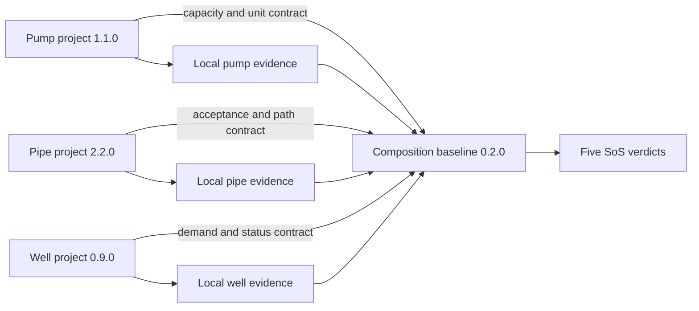

# Method: Composing Independently Developed SysML Projects

## Purpose

This experiment asks whether systems created by different teams at different times can contribute to a larger assurance conclusion without merging their internal models into one design.

The method preserves three boundaries:

1. Each constituent owns its architecture, requirements, assumptions, and local evidence.
2. Each constituent exposes a small public contract intended for integration.
3. A separate composition project owns cross-system compatibility and emergent claims.

The composition does not claim that compiling three projects proves the vessel drainage system. It evaluates new obligations that only exist once those projects are selected together.

## Independent Projects

The fixture represents three development histories:

| Constituent | Version | Local assurance responsibility |
|---|---:|---|
| Pumping unit | 1.1.0 | Produce flow with redundancy, priming, availability, and supporting approval evidence |
| Piping network | 2.2.0 | Accept pumps and flow while satisfying topology, diameter, protection, and valve constraints |
| Well monitoring | 0.9.0 | Define drainage demand and assure well, indication, access, mud-box, and strum arrangements |

Every constituent has its own `sysml-project.yml` and the same four assurance viewpoints:

- `Library.sysml` defines types and the public contract.
- `Architecture.sysml` supplies one independent configured design.
- `Requirements.sysml` records source-derived obligations.
- `Analysis.sysml` turns those obligations into kernel-evaluable Boolean evidence.

No constituent imports another constituent. It can therefore be checked before the other systems exist.

## Public Contracts

The public contract is deliberately smaller than the internal model. For example:

```text
PumpingUnitSubsystemContract
  guarantees deliveredCapacity_m3h
  guarantees operationalUnitCount

PipingNetworkSubsystemContract
  assumes a pump count and delivered flow
  guarantees acceptedPumpCount
  guarantees supportedCapacity_m3h
  guarantees flowPathAvailable

WellMonitoringSubsystemContract
  requires requiredDrainageCapacity_m3h
  guarantees outletAvailable
  guarantees operatorFeedbackAvailable
```

This is assume-guarantee reasoning. If system $A$ guarantees $G_A$ and system $B$ assumes $A_B$, their interface is compatible only when:

$$
G_A \Rightarrow A_B
$$

Local evidence remains owned by the constituent. The composition reads only contract values needed for cross-system arguments.

## Interaction Process



Practical sequence:

1. Constituent team validates and versions its project independently.
2. Team publishes a contract surface and local assertion catalogue.
3. Integrator selects exact constituent versions for one composition baseline.
4. Composition loads the selected contract definitions and configuration values.
5. Kernel evaluates local obligations and composition-only obligations together.
6. Evidence records identify the constituent versions, composition version, scenario, and expected result.
7. Any constituent change invalidates only affected compatibility and emergent evidence, which must be rerun before acceptance.

This fixture performs steps 3-5 by loading exact local source layers into one kernel session. That proves SysML package composition and rule evaluation. It does not yet prove federated retrieval across separate Pilot API projects.

For separately published API projects, the composition baseline should add a dependency lock containing:

```yaml
constituents:
  - name: PumpingUnitSubsystem
    version: 1.1.0
    project_uuid: <published-project>
    commit_uuid: <published-commit>
    contract_hash: <sha256>
  - name: PipingNetworkSubsystem
    version: 2.2.0
    project_uuid: <published-project>
    commit_uuid: <published-commit>
    contract_hash: <sha256>
```

UUIDs locate API objects; content hashes establish assurance identity. Mutable project names or version labels alone are insufficient.

## Complex Rule Patterns

The selected DNV extraction rules exercise several SysML reasoning forms.

### Conditional applicability

DNV #17 applies a priming obligation only to centrifugal pumps. The executable implication is:

$$
\neg centrifugal \lor selfPriming \lor centralPrimingConnected
$$

DNV #35 similarly constrains emergency suction diameter only when that optional suction is fitted.

### Derived geometry

DNV #28 compares pipe areas. The architecture derives circular area from mock diameters using:

$$
A = \frac{\pi}{4}d^2
$$

The check then requires main-pipe area to be at least twice the engine-room branch area. This demonstrates a requirement over a derived property rather than a copied Boolean.

### Evidence-dependent acceptance

DNV #18 requires pressure-loss calculations for high water velocity. Unit A deliberately uses a mock $5.2\,m/s$ design, exceeding the $5\,m/s$ trigger. It passes only because `pressureLossCalculationApproved` is true.

### Configuration and protection

DNV #44 requires cargo-hold pipes to be protected. The experiment refines the broad phrase into a stricter local acceptance profile requiring:

- mechanical protection by cover or built-in routing;
- mock material suitability evidence;
- mock corrosion-protection evidence.

The last two are experimental engineering inputs, not claimed as verbatim text from DNV #44.

DNV #55 uses another conditional configuration: fittings below floor level are accepted only with a removable floor plate and identifying nameplate.

## Five Emergent SoS Rules

An emergent rule references facts owned by at least two constituents, or states an end-to-end property no constituent can prove alone.

| Rule | Combined facts | Derivation and meaning |
|---|---|---|
| `SOS-001 CapacityCompatibility` | Pump delivered capacity; well drainage demand | Pumping must provide at least the demand established by the drained space. Pump PASS alone does not show it is sized for this well. |
| `SOS-002 PipingCompatibility` | Pump delivered capacity; pipe supported capacity | Piping must carry the selected pumps' output. Pipe PASS alone may describe a valid but undersized network. |
| `SOS-003 ConnectionCompatibility` | Operational pump count; accepted pipe connections | Every operational pumping unit needs an accepted connection. Independent compliance does not prove interface cardinality. |
| `SOS-004 EndToEndFlowPath` | Well outlet availability; pipe flow-path availability | Water must have a continuous route from source to discharge. Neither endpoint can establish continuity alone. |
| `SOS-005 DegradedOperation` | Single-pump capacity; operator feedback | After losing one unit, remaining capacity and observable status must coexist. This combines physical resilience with operational awareness. |

These rules were obtained by walking the end-to-end function:

```text
collect water -> demand drainage -> pump water -> accept flow -> discharge water -> report status
```

At each boundary, the method asks:

1. What guarantee leaves the upstream constituent?
2. What assumption must the downstream constituent receive?
3. What failure appears only after selecting both systems?

The first three rules are interface compatibility checks. The fourth is an emergent functional claim. The fifth is an emergent degraded-mode assurance claim.

## Falsifiability

`SOS-002-NEG` composes a historical piping contract limited to $80\,m^3/h$ with pumping output of $100\,m^3/h$. Both models can be internally coherent, but the composition verdict is `false`:

$$
80 \not\ge 100
$$

This negative case is important. Without a known incompatible composition, green verdicts would show execution but not that the contract boundary can reject a bad system selection.

## Current Limit

The SysML experiment proves independent kernel validation, package-level composition, conditional and derived rules, contract checks, and a falsifiable integration verdict.

The adjacent [runtime MVP](runtime-mvp/README.md) now demonstrates deterministic digest-addressed packages, an automated lock, exact project/commit/digest resolution with mock API receipts, a constituent-change matrix, fixed-step mock coupling, asynchronous replay, and append-only observations/evidence. It intentionally does not publish scratch projects into the shared Pilot API or package real FMUs. Those are transport substitutions after the contract and event semantics are accepted.