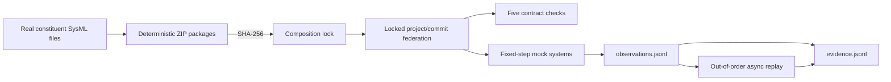

# Runnable Contract and Runtime MVP

This is the smallest end-to-end implementation of the proposed system-of-systems workflow. It uses only Python's standard library and does not modify or publish the authoritative SysML models.

For a slower, step-by-step explanation tied to every file and function, see [SOFTWARE-WALKTHROUGH.md](SOFTWARE-WALKTHROUGH.md).

## Run

Use the canonical environment:

```bash
cd /home/manret/MONS/mons_wp1/SysMLInfra
/home/manret/SysMLInfra/.venv/bin/python \
  examples/system-of-systems/runtime-mvp/mvp.py --clean
```

Expected summary:

```json
{
  "locked_constituents": 3,
  "matrix_cases": 6,
  "observations_appended": 12,
  "sync_statuses": {
    "SOS-001": "PASS",
    "SOS-002": "PASS",
    "SOS-003": "PASS",
    "SOS-004": "PASS",
    "SOS-005": "PASS"
  },
  "async_status": "INCONCLUSIVE"
}
```

Run without `--clean` to append another observation/evidence run. Use `--clean` when a fresh demonstration is wanted.

## What to Inspect

Generated files live in `runtime-mvp/output/` and are ignored by Git:

| Output | Meaning |
|---|---|
| `releases/*.zip` | Deterministic package containing actual constituent SysML sources and contract |
| `composition.lock.json` | Exact package digest plus project/commit receipt for each constituent |
| `federated-registry.json` | Mock API response registry keyed by project UUID |
| `compatibility-report.json` | Six constituent-version/change cases and affected SoS verdicts |
| `observations.jsonl` | Append-only synchronous mock signal exchange |
| `evidence.jsonl` | Append-only synchronous and asynchronous assurance results |
| `summary.json` | Latest run summary |

## Implemented Flow



### Immutable package distribution

Every archive contains actual `Library`, `Architecture`, `Requirements`, and `Analysis` SysML layers, assertion catalogue, manifest, and exported `contract.json`. Files are sorted, timestamps fixed, and SHA-256 calculated over names and contents. Same inputs produce the same digest and archive name. Modified archives fail verification.

### Cross-project resolution

The MVP generates deterministic mock project and commit UUIDs because it must not pollute the shared local Pilot API. Composition reads exports only after project UUID, commit UUID, and package digest all match the lock. Missing projects and mismatched commits or digests fail closed.

To use the real API later, replace registry generation with calls to `http://localhost:9000` that fetch each locked project and commit. Keep `resolve_locked_exports()` unchanged: transport changes, lock semantics do not.

### Stability matrix

The compatibility report evaluates:

| Case | Expected result |
|---|---|
| Baseline | All five PASS |
| Pump capacity 95 m3/h | Compatible; all PASS |
| Pump capacity 115 m3/h | `SOS-002` FAIL |
| One piping connection | `SOS-003` FAIL |
| Well demand 105 m3/h | `SOS-001` FAIL |
| Renamed/missing pump export | Dependent rules BLOCKED |

This is the practical definition of contract stability: compatible changes preserve behavior; breaking changes fail or block the expected obligations rather than silently passing.

### Intra-system read/write loop

The model side is read-only during execution:

1. Package and verify constituent sources.
2. Read locked public contract exports.
3. Feed exports into mock systems.
4. Append timestamped/ordered signals to `observations.jsonl`.
5. Evaluate and append results to `evidence.jsonl`.

Runtime data never rewrites `Architecture.sysml`. A proposed design change should create a new constituent version, digest, lock, and evidence baseline.

### Synchronous and asynchronous coupling

Synchronous mode advances four fixed one-second steps:

```text
well demand -> pump produced flow -> pipe delivered flow
```

Asynchronous mode replays those events out of order and intentionally removes recent piping events. At watermark `t=3`, delivered flow is too old, so runtime rule `SOS-004-RUNTIME` becomes `INCONCLUSIVE`, not a false PASS.

## Tests

```bash
cd /home/manret/MONS/mons_wp1/SysMLInfra
/home/manret/SysMLInfra/.venv/bin/python -m pytest \
  tests/unit/test_system_of_systems_mvp.py -q
```

Tests verify the full run, expected compatibility failures, deterministic archives, tamper rejection, and locked commit mismatch rejection.