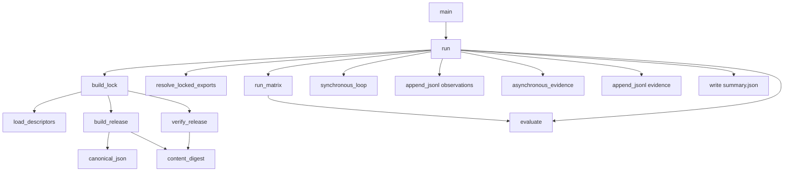

# Software Walkthrough: System-of-Systems MVP

This guide explains the MVP twice at the same time:

- in simple system-engineering terms;
- in terms of the exact files and Python functions implementing each step.

The whole program is intentionally one Python file, [mvp.py](mvp.py), so the flow can be followed without jumping through a framework.

## The Simple Picture

Imagine three teams deliver three boxes:

1. Pump team delivers a pumping system.
2. Pipe team delivers a piping system.
3. Monitoring team delivers a well-monitoring system.

Each box works independently. The important question is whether these particular versions work together.

```text
Pump promises 100 m3/h
          |
          v
Pipe accepts 110 m3/h
          |
          v
Well requires 90 m3/h and reports status
```

The MVP performs this process:

```text
read descriptions
  -> package real SysML files
  -> fingerprint packages
  -> lock exact selections
  -> verify identities
  -> read public promises
  -> evaluate five SoS rules
  -> test pretend version changes
  -> exchange mock runtime values
  -> append observations and evidence
```

## Files at a Glance

### Inputs committed to Git

| File | Purpose |
|---|---|
| [mvp.py](mvp.py) | Entire executable workflow |
| [contracts/pumping-unit.json](contracts/pumping-unit.json) | Pump version, source files, and exported promises |
| [contracts/piping-network.json](contracts/piping-network.json) | Pipe version, source files, and exported promises |
| [contracts/well-monitoring.json](contracts/well-monitoring.json) | Well version, source files, and exported promises |
| [test_system_of_systems_mvp.py](../../../tests/unit/test_system_of_systems_mvp.py) | Automated tests |

Each contract descriptor points to a real independent SysML project one directory above:

```text
contracts/pumping-unit.json
        |
        +--> ../../pumping-unit/Library.sysml
        +--> ../../pumping-unit/Architecture.sysml
        +--> ../../pumping-unit/Requirements.sysml
        +--> ../../pumping-unit/Analysis.sysml
        +--> ../../pumping-unit/assertions.py
        +--> ../../pumping-unit/sysml-project.yml
```

### Outputs generated when running

| File | Written by | Meaning |
|---|---|---|
| `output/releases/*.zip` | `build_release()` | Sealed constituent packages |
| `output/composition.lock.json` | `build_lock()` | Exact selected versions, hashes, and receipts |
| `output/federated-registry.json` | `build_lock()` | Mock API registry keyed by project UUID |
| `output/compatibility-report.json` | `run()` using `run_matrix()` | Results of six pretend version changes |
| `output/observations.jsonl` | `append_jsonl()` | Runtime signal history |
| `output/evidence.jsonl` | `append_jsonl()` | Assurance verdict history |
| `output/summary.json` | `run()` | Compact result of latest execution |

The `output/` directory is ignored by Git because these are generated execution records, not authoritative model sources.

## Program Entry Point

The shell command starts `main()`:

```bash
cd /home/manret/MONS/mons_wp1/SysMLInfra
/home/manret/SysMLInfra/.venv/bin/python \
  examples/system-of-systems/runtime-mvp/mvp.py --clean
```

Relevant code:

```python
def main() -> int:
    parser = argparse.ArgumentParser(...)
    parser.add_argument("--output", ...)
    parser.add_argument("--clean", action="store_true", ...)
    args = parser.parse_args()
    summary = run(args.output.resolve(), clean=args.clean)
    print(json.dumps(summary, indent=2))
    return 0
```

`main()` does only three things:

1. Read command-line options.
2. Call `run()`.
3. Print returned summary.

`run()` is the orchestrator. Everything below happens in the order shown there.

## Step 1: Read Subsystem Descriptions

**Simple meaning:** Read labels attached to the three delivered boxes.

**Function:** `load_descriptors()`

```python
def load_descriptors():
    return [
        json.loads(path.read_text())
        for path in sorted(CONTRACTS.glob("*.json"))
    ]
```

It reads the three files under `contracts/` in stable alphabetical order.

Example pump descriptor:

```json
{
  "name": "PumpingUnitSubsystem",
  "version": "1.1.0",
  "project_dir": "../../pumping-unit",
  "source_files": ["Library.sysml", "Architecture.sysml"],
  "exports": {
    "deliveredCapacity_m3h": 100.0,
    "operationalUnitCount": 2,
    "singlePumpCapacity_m3h": 60.0
  }
}
```

The actual descriptor includes all source files. The shortened example highlights two different data categories:

- `source_files` identifies the model being packaged.
- `exports` is the small public contract visible to composition.

The composition does not need every pump attribute. It only needs promises used by cross-system rules.

## Step 2: Package Each Subsystem

**Simple meaning:** Put each box and its paperwork into a sealed shipping container.

**Function:** `build_release(descriptor, output)`

For each descriptor, this function:

1. Resolves `project_dir`.
2. Reads the real SysML source files as bytes.
3. Creates a small `contract.json` containing name, version, and exports.
4. Calculates a content digest.
5. Writes a ZIP under `output/releases/`.
6. Returns a release record.

The ZIP is deterministic:

- entries are sorted by name;
- every ZIP timestamp is fixed to `1980-01-01`;
- file permissions are fixed;
- contract JSON keys are sorted.

Therefore unchanged input produces the same ZIP name and digest on every run.

Example archive name:

```text
PumpingUnitSubsystem-1.1.0-4cb012345678.zip
```

The last part is the beginning of the SHA-256 digest.

## Step 3: Fingerprint Contents

**Simple meaning:** Give each sealed container a fingerprint. Any changed item changes the fingerprint.

**Functions:** `canonical_json()` and `content_digest()`

`canonical_json()` serializes JSON consistently:

```python
json.dumps(value, sort_keys=True, separators=(",", ":"))
```

`content_digest()` processes every filename and file body in sorted order:

```text
SHA-256(
  filename A + contents A +
  filename B + contents B +
  ...
)
```

Including filenames matters. Renaming `Library.sysml` changes package identity even if its bytes remain unchanged.

## Step 4: Create the Composition Lock

**Simple meaning:** Write an assembly order saying exactly which three sealed boxes must be used.

**Function:** `build_lock(output)`

It calls `build_release()` for every descriptor, then writes:

```text
output/composition.lock.json
```

Simplified structure:

```json
{
  "schema": "sos-lock/1",
  "constituents": [
    {
      "name": "PumpingUnitSubsystem",
      "version": "1.1.0",
      "digest": "sha256:...",
      "archive": "releases/PumpingUnitSubsystem-1.1.0-....zip",
      "api_receipt": {
        "mode": "mock",
        "project_uuid": "...",
        "commit_uuid": "..."
      }
    }
  ]
}
```

Version alone is not enough. Someone could replace files while retaining `1.1.0`. The digest identifies actual contents.

## Step 5: Verify Every Package

**Simple meaning:** Open each container, recalculate its fingerprint, and reject it if contents changed.

**Function:** `verify_release(item, output)`

The function:

1. Opens locked ZIP.
2. Reads every entry.
3. Recalculates SHA-256.
4. Compares result to locked digest.
5. Raises `ValueError` on mismatch.
6. Returns verified `contract.json` on success.

No composition checking happens before this identity check.

The tampering test adds `tampered.txt` to an archive and confirms verification fails.

## Step 6: Create and Resolve the Mock API Registry

**Simple meaning:** Look up each box in a warehouse catalogue using exact project and commit identifiers.

**Functions:** `build_lock()` and `resolve_locked_exports()`

`build_lock()` writes:

```text
output/federated-registry.json
```

The registry imitates data a real SysML API federation adapter would return:

```json
{
  "project-uuid": {
    "commit_uuid": "commit-uuid",
    "digest": "sha256:...",
    "exports": {
      "deliveredCapacity_m3h": 100.0
    }
  }
}
```

`resolve_locked_exports()` walks the lock and verifies three things for each subsystem:

```text
locked project UUID == registry project UUID
locked commit UUID  == registry commit UUID
locked digest       == registry digest
```

It fails closed when any value differs. Only then does it return exports.

Current UUIDs are deterministic mock values generated with `uuid.uuid5()`. They let us test identity semantics without creating scratch projects in shared API at `localhost:9000`.

Later, a real API adapter can populate the same registry structure from locked project and commit endpoints. `resolve_locked_exports()` need not change.

## Step 7: Give the Selection One Baseline Identity

**Simple meaning:** Fingerprint the complete assembly order, not only individual boxes.

**Code inside:** `run()`

```python
baseline_id = hashlib.sha256(canonical_json(lock)).hexdigest()
```

Every observation and evidence row carries this `baseline_id`. This answers:

> Exactly which combination of subsystem packages produced this result?

Changing any constituent digest, version, project receipt, or commit receipt changes baseline identity.

## Step 8: Evaluate Five SoS Rules

**Simple meaning:** Check whether promises from selected boxes fit together.

**Function:** `evaluate(exports)`

The function reads three verified export dictionaries:

```python
pump = exports["PumpingUnitSubsystem"]
pipe = exports["PipingNetworkSubsystem"]
well = exports["WellMonitoringSubsystem"]
```

It evaluates:

| Rule | Software comparison | Baseline result |
|---|---|---|
| `SOS-001` | pump delivered capacity $\ge$ well demand | $100 \ge 90$: PASS |
| `SOS-002` | pipe supported capacity $\ge$ pump output | $110 \ge 100$: PASS |
| `SOS-003` | accepted pipe connections $\ge$ operating pumps | $2 \ge 2$: PASS |
| `SOS-004` | well outlet available AND pipe path available | true AND true: PASS |
| `SOS-005` | one pump $\ge 50$ m3/h AND operator feedback | $60 \ge 50$ AND true: PASS |

Why these are SoS rules:

- pump project cannot know selected well demand;
- pipe project cannot know selected pump output;
- well project cannot know selected piping route;
- no constituent can prove end-to-end compatibility alone.

Status handling:

```text
value missing -> BLOCKED
comparison true -> PASS
comparison false -> FAIL
```

Missing information is not treated as failure or success. It is explicitly blocked.

## Step 9: Test Contract Stability

**Simple meaning:** Try several pretend upgrades before accepting a real upgrade.

**Function:** `run_matrix(base)`

The function deep-copies baseline exports, changes one value, and calls `evaluate()` again.

| Pretend change | Expected behavior |
|---|---|
| No change | All PASS |
| Pump output 95 m3/h | Still compatible |
| Pump output 115 m3/h | `SOS-002` FAIL because pipe accepts only 110 |
| Pipe accepts one pump | `SOS-003` FAIL because two pumps operate |
| Well demands 105 m3/h | `SOS-001` FAIL because pump provides 100 |
| Pump export removed/renamed | Dependent checks BLOCKED |

Results go to:

```text
output/compatibility-report.json
```

This is how stability is measured. A stable contract does not mean every future version passes. It means:

- compatible changes continue to pass;
- incompatible changes fail the expected rule;
- missing or renamed data blocks dependent reasoning;
- changes never silently produce an unrelated green result.

## Step 10: Run the Synchronous Mock Loop

**Simple meaning:** Move four clock ticks forward while boxes exchange values in fixed order.

**Function:** `synchronous_loop(exports, baseline_id)`

At each simulated second:

```text
well publishes demand
  -> pump publishes produced flow
  -> piping publishes delivered flow
```

Mock equations:

```python
produced = min(demand + sequence * 2.0, pump_capacity)
delivered = min(produced, pipe_capacity)
```

There are four steps and three signals per step, producing 12 events.

Example observation:

```json
{
  "baseline_id": "...",
  "producer": "pumping-unit",
  "sim_time": 2.0,
  "sequence": 2,
  "signal": "producedFlow_m3h",
  "value": 94.0,
  "unit": "m3/h",
  "quality": "GOOD"
}
```

This is mock FMU-style coupling. Real FMUs would replace equations, but event envelope and assurance handling can remain.

## Step 11: Append Observations

**Simple meaning:** Write every runtime message into a logbook without erasing earlier pages.

**Function:** `append_jsonl(path, records)`

JSONL means one JSON object per line. It is useful here because records append naturally and can stream without loading entire history.

Output:

```text
output/observations.jsonl
```

With `--clean`, old generated output is removed first. Without `--clean`, another run appends 12 more lines.

SysML files remain unchanged. Runtime readings are evidence about a baseline, not automatically new design values.

## Step 12: Evaluate Asynchronous Behavior

**Simple meaning:** Messages arrive late and out of order; old data must not produce false confidence.

**Function:** `asynchronous_evidence(events, baseline_id)`

The demonstration deliberately:

1. Reverses event arrival order.
2. Removes pipe events newer than simulated time 1.
3. Reconstructs latest event per signal by timestamp.
4. Evaluates at watermark time 3.
5. Rejects values older than 1.5 seconds.

Latest pipe value is from time 1:

$$
3.0 - 1.0 = 2.0 > 1.5
$$

Therefore result is:

```text
SOS-004-RUNTIME = INCONCLUSIVE
reason = deliveredFlow_m3h stale
```

This is intentional. Stale telemetry should not become PASS merely because its old value looked acceptable.

## Step 13: Append Assurance Evidence

**Simple meaning:** Write conclusions into a separate assurance logbook.

**Code inside:** `run()` using `append_jsonl()`

Two evidence groups are written:

1. Five synchronous composition verdicts from `evaluate()`.
2. One asynchronous freshness verdict from `asynchronous_evidence()`.

Output:

```text
output/evidence.jsonl
```

Each row carries baseline identity, mode, rule, and status. Observations answer “what was received?” Evidence answers “what does it mean for an obligation?”

## Step 14: Write and Print Summary

**Simple meaning:** Produce a receipt for the run.

**Code inside:** `run()` and `main()`

`run()` writes `output/summary.json` and returns same dictionary. `main()` prints it.

Important distinction:

- `summary.json` is latest convenience view and is overwritten.
- `observations.jsonl` and `evidence.jsonl` are append-only histories unless `--clean` is requested.

## Complete Function Call Order



## How Tests Map to the Workflow

Test file: [test_system_of_systems_mvp.py](../../../tests/unit/test_system_of_systems_mvp.py)

### `test_end_to_end_outputs_and_expected_failures`

Runs full workflow in temporary directory and checks:

- five synchronous rules PASS;
- asynchronous result is INCONCLUSIVE;
- 12 observations were generated;
- expected matrix changes fail or block correct rules.

### `test_release_is_deterministic_and_tampering_is_rejected`

Builds same release twice and verifies same digest and filename. It then modifies ZIP and confirms `verify_release()` rejects it.

### `test_locked_federation_fails_on_commit_mismatch`

Changes registry commit UUID and confirms `resolve_locked_exports()` refuses to return exports.

Run tests:

```bash
cd /home/manret/MONS/mons_wp1/SysMLInfra
/home/manret/SysMLInfra/.venv/bin/python -m pytest \
  tests/unit/test_system_of_systems_mvp.py -q
```

## What Is Real and What Is Mocked

| Area | Real now | Mocked now |
|---|---|---|
| Constituent models | Actual SysML source files | Nothing |
| Packaging | Actual deterministic ZIP and SHA-256 | Nothing |
| Locking | Actual generated lock and identity checks | Nothing |
| API location | Project/commit matching logic | UUID values and registry transport |
| Contract checks | Actual five-rule evaluation | Export values originate in descriptor JSON |
| Runtime coupling | Actual ordered event production and logs | Component equations instead of FMUs |
| Async handling | Actual out-of-order/latest/freshness logic | Deterministic event loss scenario |
| Evidence | Actual append-only JSONL | Not yet materialized into PostgreSQL/SysML API |

## How This Becomes Production-Like

The design keeps replacement points narrow:

1. Replace descriptor exports with values extracted from locked published SysML commits.
2. Replace mock registry generation with paged calls to local API `http://localhost:9000`.
3. Replace `synchronous_loop()` equations with FMI `set`, `do_step`, and `get` calls.
4. Replace JSONL transport with MQTT, OPC-UA, or database events if needed.
5. Preserve package digests, lock checks, baseline identity, freshness rules, and evidence semantics.

The key idea is that transport and simulation engines can change without changing assurance questions.

## Recommended Reading Order

1. Run MVP once with `--clean`.
2. Open `output/summary.json`.
3. Open `output/composition.lock.json`.
4. Compare one contract descriptor with its ZIP `contract.json`.
5. Open `output/compatibility-report.json` and find `oversized-pump-115`.
6. Read first three lines of `output/observations.jsonl`.
7. Open `output/evidence.jsonl` and find `SOS-004-RUNTIME`.
8. Follow `run()` in [mvp.py](mvp.py) from top to bottom.

That order moves from visible result back toward implementation details.